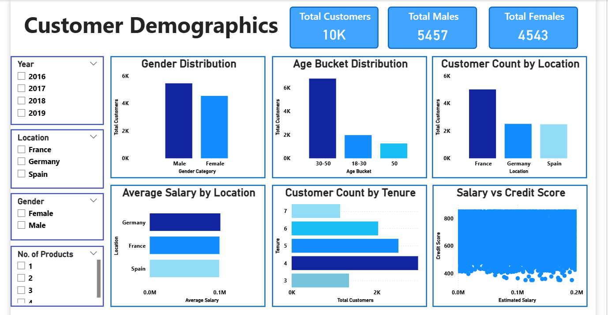
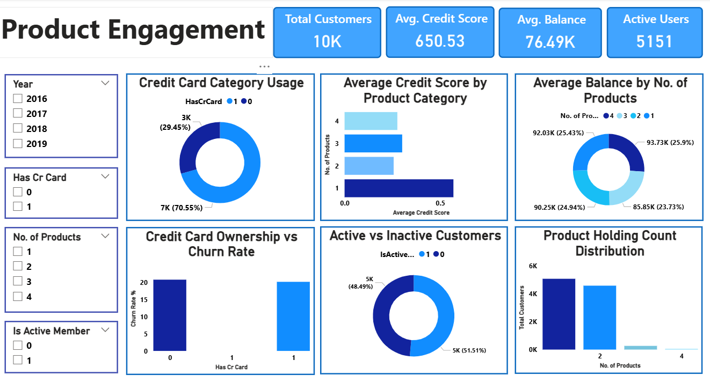
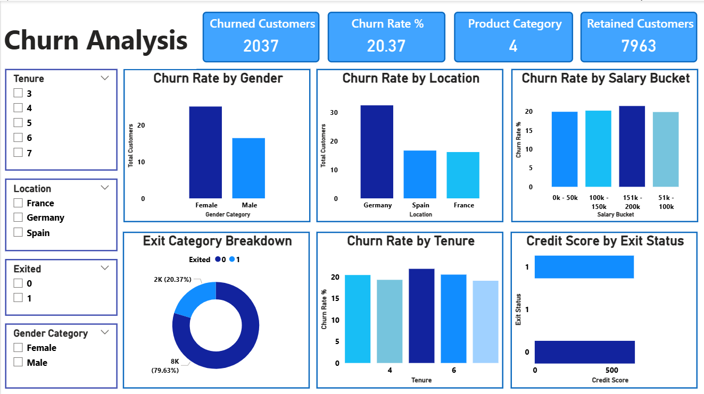

# 🏦 Bank Customer Churn Analysis — Customer Retention Insights

Business analytics project using SQL, Power BI, and DAX to analyze customer churn, identify high-churn customer segments, quantify balance exposure, and develop a data-driven retention framework.


---

## 📑 Table of Contents

- [Overview](#-overview)
- [Business Problem](#-business-problem)
- [Project Objectives](#-project-objectives)
- [Dataset Overview](#-dataset-overview)
- [Tools & Tech Stack](#-tools--tech-stack)
- [Methodology](#-methodology)
- [Dashboards](#-dashboards)
- [Key Insights](#-key-insights)
- [Heuristic Risk Scoring Model](#-risk-scoring-model)
- [SQL Analysis Highlights](#-sql-analysis-highlights)
- [Strategic Recommendations](#-strategic-recommendations)
- [Conclusion](#-conclusion)
- [Author](#-author)

---

## 📌 Overview

Customer retention is an important business problem in retail banking because customer exits can reduce relationship value, product adoption, and future revenue opportunities. This project analyzes **10,000 bank customers** across **France, Germany, and Spain (2016–2019)** to:

- Quantify customer churn and associated balance exposure
- Identify demographic, geographic, and behavioral factors associated with attrition
- Build a **Heuristic Churn Risk Score** to flag and prioritize customers for review
- Translate findings into an actionable, phased retention strategy for bank leadership

The project combines **PostgreSQL** for analytical querying, **Power Query/Power BI** for data validation and modeling, **DAX** for KPI and risk-score calculations, and a 3-page primary dashboard plus 2 extended analysis pages, supported by an executive presentation.

## 🎯 Business Problem

> The bank is experiencing a 20.37% customer churn rate across the analyzed portfolio. The business needs to understand which customer segments show higher observed churn, how much customer balance is associated with those exits, and where retention teams should prioritize further investigation.

The analysis evaluates geography, demographics, customer activity, product ownership, and financial characteristics to identify actionable churn patterns.

## 🎯 Project Objectives

| # | Objective | Focus |
|---|---|---|
| 1 | **Churn Performance Assessment** | Establish baseline churn rate and yearly trend (2016–2019) |
| 2 | **High-Churn Segment Identification** | Surface segments (geography, age, gender) with disproportionate churn |
| 3 | **Balance Exposure Quantification** | Measure deposit/balance value at risk from churned vs. retained customers |
| 4 | **Churn Factor Analysis** | Analyze geography, age, activity status, and product ownership as factors associated with churn |
| 5 | **Risk Segmentation & Scoring** | Build a transparent composite score to classify customers into Red / Amber / Green review tiers |
| 6 | **Strategic Retention Framework** | Design a phased, targeted retention and cross-sell strategy |

## 🗃️ Dataset Overview

The data is modeled as **7 relational tables** (star-schema style) with zero missing values, joined on `CustomerID`, `GenderID`, and `GeographyID`.

| Table | Description | Key Columns |
|---|---|---|
| `bank_churn` | Core fact table — account & behavior details | `CustomerID`, `CreditScore`, `Balance`, `NumOfProducts`, `Tenure`, `IsActiveMember`, `HasCrCard`, `Exited` |
| `customerinfo` | Customer profile | `CustomerID`, `Surname`, `Age`, `EstimatedSalary`, `GenderID`, `GeographyID`, `Bank DOJ` |
| `gender` | Gender lookup | `GenderID`, `GenderCategory` |
| `geography` | Region lookup | `GeographyID`, `GeographyLocation` (France / Germany / Spain) |
| `creditcard` | Credit card ownership lookup | `CreditID`, `Category` |
| `activecustomer` | Activity status lookup | `ActiveID`, `ActiveCategory` |
| `exitcustomer` | Churn label lookup | `ExitID`, `ExitCategory` (Retained / Exited) |

**Target variable:** `Exited` (1 = churned, 0 = retained) · **Churn prevalence:** 20.37% · **Data quality:** validated for nulls and duplicates via Power Query. A separate review identified **735 records with `Exited = 1` and `IsActiveMember = 1`**; this combination is not inherently impossible without a defined business rule, so it should be treated as a data-quality/business-definition check rather than automatically corrected.

## 🛠️ Tools & Tech Stack

| Category | Tools |
|---|---|
| Data Querying & Analysis | **PostgreSQL** (joins, CTEs, window functions, aggregations) |
| Data Modeling & Visualization | **Power BI Desktop** (Power Query, relationships, interactive dashboards) |
| Calculations | **DAX** (measures, calculated columns, conditional formatting logic) |
| Reporting | **PowerPoint** (executive stakeholder deck) |


## 🔍 Methodology

1. **Business Understanding** — Framed churn as the core problem; retention improvement as the objective.
2. **Data Review & Validation** — Validated 10,000 records across 7 relational tables for nulls and duplicates; flagged the `Exited = 1` and `IsActiveMember = 1` combination for business-rule review rather than treating it as inherently invalid.
3. **SQL Analysis** — Implemented the SQL questions present in the supplied SQL file using joins, CTEs, window functions (`RANK`, `LAG`), aggregations, and segmentation logic. The supplied SQL file contains 13 clearly labeled objective questions plus additional subjective queries.
4. **KPI & Measure Development** — Built core DAX measures: Total Customers, Churn Rate %, Avg. Balance, Avg. Credit Score, and a Heuristic Churn Risk Score.
5. **Dashboard Reporting** — Designed a 3-page interactive Power BI dashboard (Demographics → Product Engagement → Churn Analysis) with cross-filtering slicers (Year, Location, Gender, No. of Products).
6. **Risk Segmentation & Strategy** — Classified customers into Red/Amber/Green review tiers using a transparent heuristic score and translated the observed patterns into a phased retention roadmap.

## 📊 Dashboards

### Dashboard 1 — Customer Demographics


Profiles the 10,000-customer base by gender, age bucket, geography, salary, and tenure, and inspects the salary-vs-credit-score relationship.

### Dashboard 2 — Product Engagement


Examines credit card penetration (70.55%), product holding distribution, active vs. inactive split, and how credit card ownership and product count relate to churn.

### Dashboard 3 — Churn Analysis


Breaks down the 20.37% churn rate by gender, location, salary bucket, tenure, and credit score, with an exit-category summary.

> The `.pbix` file also contains two extended analysis pages — a **Churn Risk Scoring page** (Red/Amber/Green segmentation with balance exposure) and a **deep-dive analytics page** (LTV proxy, product affinity, seasonal acquisition trends, and combo charts) for advanced exploration. The LTV figure should be interpreted as a proxy rather than observed customer lifetime value.

## 💡 Key Insights

**Overall Performance**
- 2,037 of 10,000 customers churned → **20.37% churn rate**; 7,963 (79.63%) retained.
- Churn peaked at **22.35% in 2017**, improving to **19.86% in 2019** — progress, but not resolution.
- Churned customers carried an average balance of **91K+ dataset currency units** vs. about **73K** for retained customers — churn is associated with the loss of higher-balance customer relationships.

**Geographic Risk**
- **Germany: 32.4% churn** — roughly double France (16.2%) and Spain (16.7%) — despite representing about 25% of the customer base.
- Germany also has the **highest average balance among churned customers (120,361 dataset currency units)**, indicating greater balance exposure among German churned customers.

**Demographic Risk**
- Customers **aged 50+ churn at 44.6%**, a 6× multiplier versus 18–30-year-olds (7.5%).
- **Female customers aged 50+** in Germany have the highest observed churn rate in the analyzed segments at 67.0%.
- Female customers overall churn at 25.1% vs. 16.5% for males, despite being a smaller share of the base.

**Engagement & Product Drivers**
- **Single-product customers churn at 27.7% vs. 7.6% for customers with two products** — The 5,084 single-product customers represent a potential cross-sell population that should first be evaluated for product fit, engagement, and eligibility. Test whether suitable second-product adoption is associated with improved retention before scaling cross-sell campaigns.
- **5,084 customers** hold only one product — a large potential cross-sell population that should be evaluated for product fit and eligibility.
- **Inactive members churn at 26.9%**, nearly double active members (14.3%); **3,547 customers** are retained-but-inactive, a dormant secondary risk pool worth ~89K average balance per customer in dataset currency units
- Credit card ownership shows **very little difference in observed churn** (~20% in either group), so ownership alone is not a strong standalone churn discriminator in this dataset.

**Variables With Weak Observed Association**
- Salary vs. balance: r = 0.013.
- Salary vs. credit score: r = -0.001
- Tenure shows relatively limited variation in observed churn across tenure groups.

## 🚦 Heuristic Risk Scoring Model

A transparent **heuristic Churn Risk Score** was built in DAX to operationalize selected observed associations into a single review metric. It is **not a statistically trained or validated predictive model**:

```dax
ChurnRiskScore =
    (1 - CreditScore/850) * 0.30
  + (1 - IsActiveMember)  * 0.40
  + IF(NumOfProducts = 1, 0.30, 0)

RiskColor =
    IF(ChurnRiskScore > 0.65, "RED",
        IF(ChurnRiskScore > 0.35, "AMBER", "GREEN"))
```

| Tier | Customers | Actual Churn Rate |
|---|---|---|
| 🔴 **Red** (score > 0.65) | 2,521 | 36.7% |
| 🟠 **Amber** (0.35 – 0.65) | 4,168 | 17.6% |
| 🟢 **Green** (< 0.35) | 3,245 | 11.6% |

Descriptively, **Red-tier customers show about 3× the observed churn rate of Green-tier customers**. This demonstrates separation in this dataset, but it does **not validate predictive accuracy**, because no train/test split, calibration, ROC-AUC, precision/recall, or out-of-sample validation was performed. `RiskColor` is applied as conditional formatting in Power BI for prioritization and review.

## 🧮 SQL Analysis Highlights

The `power bi task sql.sql` file contains the PostgreSQL logic behind the objective questions, including:

- **Top-5 highest-earning customers** who joined in Q4, via multi-table joins
- **Credit score segmentation** (5 bands) with exit-rate ranking to find the highest-risk score band (300–450 → 32.28% exit rate)
- **Window functions** — `RANK() OVER (PARTITION BY ...)` for gender income ranking by geography, and `LAG()` for year-over-year customer acquisition growth
- **Data-quality review** identifying 735 customers with `Exited = 1` **and** `IsActiveMember = 1`; the supplied SQL file should not describe this combination as logically impossible or imply that an automatic corrective update was applied
- **No-join field derivation** using a `CASE` expression to bring `ExitCategory` into the fact table without a physical join

## ✅ Strategic Recommendations

1. . **Risk-Based Customer Prioritization** — After validation, integrate the heuristic score into a CRM workflow to help relationship managers prioritize customer-review queues.
2. **Geographic Retention Investigation** — Prioritize Germany for further retention analysis, with particular attention to the 50+ female segment, which shows a 67.0% observed churn rate.
3. **Product Penetration / Cross-Sell** — Evaluate the 5,084 single-product customers for suitable second-product offers. A 10% conversion corresponds to about 508 customers; using the observed 27.7% vs. 7.6% churn-rate difference as a simple scenario, this could imply roughly 102 fewer exits, **but this is a scenario estimate, not a causal forecast**.
4. **Customer Reactivation** — Build structured reactivation campaigns for the 3,547 inactive-but-retained customers and evaluate whether reactivation is associated with improved retention.
5. **High-Value Customer Protection** — Prioritize retention analysis for higher-balance customer segments, given that churned customers show higher average balance exposure than retained customers.
6. **Lifecycle & Loyalty Program** — Test milestone-based engagement using tenure as one segmentation variable; the current analysis does not establish that a specific Years 3/5/7 program or loyalty incentive will reduce churn.
7. **Investigate High Product-Count Churn** — Audit the 3–4 product segment to understand why churn remains elevated despite higher product ownership. Review product mix, fees, customer engagement, and service experience before drawing conclusions about the underlying cause.
## 🏁 Conclusion

The analysis identified meaningful differences in observed churn across geography, age, activity status, and product ownership. The findings provide a practical segmentation framework for prioritizing retention investigations. The heuristic risk score is a screening tool rather than a validated predictive model, and future work should include out-of-sample validation and intervention testing.

## 👤 Author

**Ronak Bhatia**

---

⭐ If you found this project useful, consider starring the repo!
